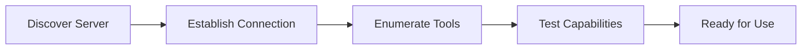

import { RandyAssistant } from '../../../components/randy/RandyAssistant.tsx';

# MCP Server Connection with Randy

Learn how to connect Randy to real MCP servers and explore live server capabilities. This page demonstrates Randy in **Request-Response Mode**, perfect for technical interactions and server management.

## 🔌 Request-Response Mode

This mode is optimized for structured technical requests and detailed responses:

<RandyAssistant mode="request-response" mcpServerUrl="http://localhost:3000" client:load />

## Understanding MCP Connections

### What is an MCP Server?

An MCP (Model Context Protocol) server provides tools and resources that AI assistants can use to interact with external systems. Randy can connect to any MCP-compatible server to:

- **Execute Tools**: Run server-specific functions
- **Access Resources**: Read data from the server
- **Manage State**: Maintain session information
- **Handle Errors**: Gracefully manage connection issues

### Connection Process

Randy follows a standardized connection process:



1. **Discovery**: Randy locates the server endpoint
2. **Handshake**: Establishes protocol compatibility
3. **Enumeration**: Lists available tools and resources
4. **Validation**: Tests basic connectivity
5. **Activation**: Server is ready for use

## Live Server Examples

### Pocket-Pick Server

The pocket-pick server is our primary test server that demonstrates core MCP capabilities:

**Available Tools:**
- `search_items`: Search through stored text items
- `add_item`: Add new items with tags
- `get_item_by_id`: Retrieve specific items
- `list_tags`: Get all available tags

**Example Interaction:**
```
You: "Connect to pocket-pick and search for items about 'AI'"
Randy: "Oh my God, let's dive into that pocket-pick server! 
Connecting now... Sweet! I found several AI-related items!"
```

### Custom Server Setup

To connect Randy to your own MCP server:

**Prerequisites:**
```bash
# Your server must implement MCP protocol
curl -X POST http://your-server/mcp \
  -H "Content-Type: application/json" \
  -d '{"method": "initialize", "params": {"clientInfo": {"name": "randy"}}}'
```

**Connection Configuration:**
1. Ensure your server is running
2. Verify MCP protocol compliance
3. Update the server URL in Randy's connection panel
4. Test the connection

## Interactive Examples

### Basic Server Query

Try this with Randy:

```
Request: "What tools are available on the connected server?"

Expected Randy Response: 
"Awesome question! Let me check what this server can do... 
*connects and enumerates tools*
Sweet! I found these tools: search_items, add_item, get_item_by_id, list_tags"
```

### Tool Execution

```
Request: "Search for items containing 'javascript' and show me the results"

Expected Randy Response:
"Oh boy, JavaScript search coming right up! 
*executes search_items tool*
Found 3 items about JavaScript! Here's what we got..."
```

### Error Handling

```
Request: "Connect to an invalid server URL"

Expected Randy Response:
"Aw jeez, that server connection didn't work out so well... 
Let me help you troubleshoot this connection issue!"
```

## Advanced Connection Features

### Connection Pooling

Randy can manage multiple server connections:

```typescript
interface MCPConnectionPool {
  servers: Map<string, MCPServer>;
  activeConnection: string | null;
  
  async connect(url: string, name: string): Promise<void>;
  async switchServer(name: string): Promise<void>;
  async disconnect(name: string): Promise<void>;
}
```

### Authentication

For servers requiring authentication:

```typescript
// Randy supports various auth methods
const connectionConfig = {
  url: 'https://secure-server.com/mcp',
  auth: {
    type: 'bearer' | 'basic' | 'api-key',
    credentials: 'your-token-here'
  }
};
```

### Protocol Versioning

Randy automatically negotiates protocol versions:

```json
{
  "method": "initialize",
  "params": {
    "protocolVersion": "0.1.0",
    "clientInfo": {
      "name": "randy-assistant",
      "version": "1.0.0"
    },
    "capabilities": {
      "tools": true,
      "resources": true,
      "logging": true
    }
  }
}
```

## Connection Troubleshooting

### Common Issues

**Connection Refused:**
```
Randy: "Oops! The server isn't responding. Let's check:
1. Is the server running?
2. Is the URL correct?
3. Are there firewall issues?"
```

**Protocol Mismatch:**
```
Randy: "Aw man, protocol version mismatch! 
Your server is using a different MCP version. 
Let me help you update the compatibility..."
```

**Authentication Failures:**
```
Randy: "Looks like we need the right credentials! 
Check your API key or authentication settings."
```

### Debugging Tools

Randy provides built-in debugging:

```typescript
// Connection diagnostics
const diagnostics = await randy.runDiagnostics(serverUrl);
console.log(diagnostics);
// {
//   connectivity: 'success',
//   protocol: 'compatible',
//   latency: '45ms',
//   tools: ['search_items', 'add_item'],
//   capabilities: ['read', 'write']
// }
```

## Server Development Integration

Randy can help you develop and test your own MCP servers:

### Development Workflow

1. **Code Generation**: Randy creates server templates
2. **Live Testing**: Connect to your development server
3. **Tool Validation**: Test each tool implementation
4. **Error Detection**: Identify protocol compliance issues
5. **Performance Analysis**: Monitor server responsiveness

### Testing with Randy

```
You: "Help me test my new MCP server on localhost:3001"
Randy: "Sweet! Let's test your server! I'll run through all the tools 
and make sure everything works perfectly. This is gonna be awesome!"
```

## Next Steps

Now that you understand MCP connections:

1. **[Pocket-Pick Demo](/examples/pocket-pick)** - Hands-on server interaction
2. **[Go Server Development](/mcp/go-server)** - Build your own Go server
3. **[JavaScript Server Development](/mcp/js-server)** - Alternative implementation
4. **[Randy Generator](/mcp/randy-generator)** - Let Randy create servers for you

---

**Ready to connect?** Use the interactive Randy above to start exploring MCP server connections!